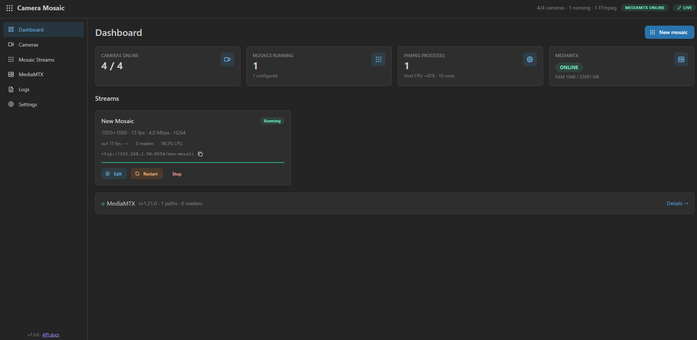
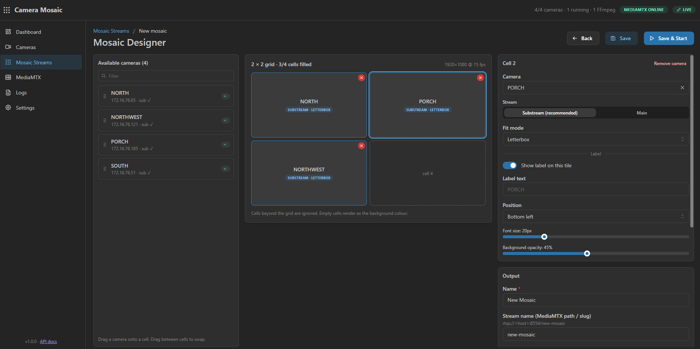
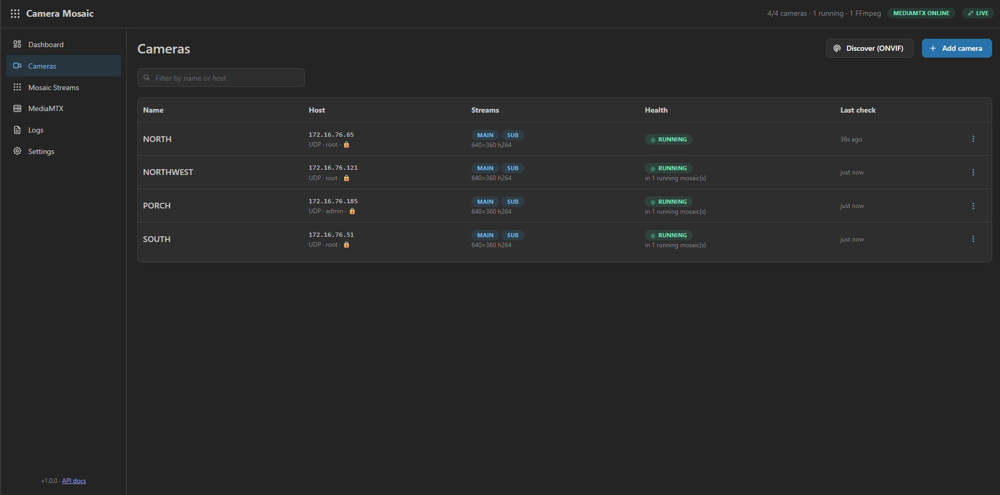
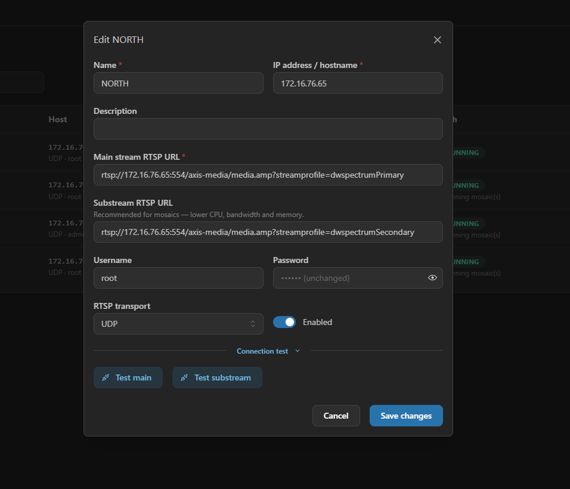

# Camera Mosaic Platform

[](LICENSE)
[](https://github.com/paulmataruso/rtsp-mosaic-maker/actions/workflows/ci.yml)

Self‑hosted appliance that pulls RTSP streams **directly from your IP cameras**,
composites them into configurable multi‑camera **mosaic streams** with FFmpeg,
and republishes each mosaic as a standards‑compliant **RTSP** stream through
[MediaMTX](https://github.com/bluenviron/mediamtx) for an existing Roku RTSP
player (or any RTSP client) on the LAN.

```
 IP Cameras ──RTSP──▶ FFmpeg (decode · scale · crop · label · xstack · H.264)
                          │
                          └──RTSP publish──▶ MediaMTX ──RTSP──▶ Roku / LAN
```

A modern web UI manages cameras, a drag‑and‑drop mosaic designer, FFmpeg
process lifecycle, and automatic MediaMTX path configuration/monitoring.

* **No Roku app** — the Roku client already exists; this only produces the stream.
* **No DW Spectrum / NVR in the video path** — cameras connect straight to FFmpeg.
* **No recording** in v1 — this is a live mosaic generator.

---

## Screenshots

| Dashboard | Mosaic Designer |
|---|---|
|  |  |

| Cameras | Add / test a camera |
|---|---|
|  |  |

---

## Quick start

Requirements: Docker Engine 24+ with the Compose plugin. That's it — FFmpeg and
MediaMTX ship in the images.

```bash
git clone https://github.com/paulmataruso/rtsp-mosaic-maker.git
cd rtsp-mosaic-maker

cp .env.example .env
# edit .env:  set APP_SECRET to a long random string
#   APP_SECRET=$(openssl rand -hex 32)
# PUBLIC_HOST can stay blank — RTSP URLs auto-use the address you open the UI on.
# Set it only for reverse-proxy / VPN setups.

docker compose up -d
```

Open the UI:

```
http://<server-ip>:3333
```

Then, entirely in the browser:

1. **Cameras → Add camera** (or **Discover (ONVIF)**), fill in the RTSP URL(s),
   username/password, and click **Test connection**.
2. **Mosaic Streams → New mosaic.**
3. Pick a layout (e.g. **4 × 4**), drag cameras into the grid, choose
   **Substream** for each tile, set **1920×1080**, **15 fps**, **H.264**, and a
   hardware encoder if one is detected.
4. **Save & Start.**

The app then generates the FFmpeg pipeline, starts it, creates/reconciles the
MediaMTX path, verifies the publisher, and shows the mosaic as **RUNNING** with
its RTSP URL:

```
rtsp://192.168.1.50:8554/warehouse
```

Point the Roku RTSP player at that URL.

---

## What's in the box

| Container  | Image                          | Role |
|------------|--------------------------------|------|
| `app`      | built from `Dockerfile`        | Node/TypeScript backend + web UI + bundled FFmpeg; spawns one FFmpeg child per running mosaic |
| `mediamtx` | `bluenviron/mediamtx:1.21.0`   | RTSP server that distributes mosaics to the LAN |

Persisted to Docker volumes: `/data` (SQLite DB + secrets) and `/logs`.
Camera video is **not** persisted.

---

## Documentation

| File | Contents |
|------|----------|
| [docs/ARCHITECTURE.md](docs/ARCHITECTURE.md) | Component design, the desired‑state model, why two containers, self‑healing reconciliation |
| [docs/DOCKER.md](docs/DOCKER.md)             | Compose files, volumes, env vars, upgrades, health checks |
| [docs/GPU.md](docs/GPU.md)                   | NVIDIA NVENC and Intel VAAPI / QSV setup |
| [docs/FFMPEG.md](docs/FFMPEG.md)             | Command‑builder design, RTSP resilience, camera‑failure handling, stream sync |
| [docs/MEDIAMTX.md](docs/MEDIAMTX.md)         | Control‑API integration, path reconciliation, upgrading MediaMTX |
| [docs/DEVELOPMENT.md](docs/DEVELOPMENT.md)   | Local dev, project layout, tests, synthetic RTSP cameras |
| [docs/API.md](docs/API.md)                   | REST + WebSocket reference (also live at `/docs`) |
| [THIRD_PARTY_NOTICES.md](THIRD_PARTY_NOTICES.md) | Dependency licenses and why AGPL is compatible with them |

---

## Common commands

```bash
docker compose up -d                 # start
docker compose logs -f app           # follow app logs
docker compose logs -f mediamtx      # follow MediaMTX logs
docker compose restart app           # restart just the app
docker compose down                  # stop (keeps volumes)
docker compose pull && docker compose up -d --build   # upgrade
```

Local development (no Docker for the app):

```bash
npm install
docker compose -f docker-compose.dev.yml up -d   # MediaMTX + 2 synthetic RTSP cameras
npm run dev                                        # backend :3333, Vite UI :5173
npm test        # backend unit tests
npm run lint
npm run build
```

---

## Performance target

Comfortable on a modern mini‑PC:

```
16 × 640×360 camera substreams  →  4×4 mosaic  →  1920×1080 H.264 @ 15 fps  →  RTSP
```

`16 × 1080p` main streams need a hardware encoder — see
[docs/GPU.md](docs/GPU.md). The designer shows a live resource estimate and the
dashboard shows measured CPU/RAM.

## License

[GNU AGPL v3.0](LICENSE) or later.

This is a network-facing appliance (web UI + REST/WebSocket API), which is
exactly the case the AGPL is designed for: if you run a modified version of
this project as a service, the AGPL requires you to make the modified source
available to the people using it. Unmodified use, self-hosting, and internal
deployment are unaffected — the source is already public.

The project's own code (this repository) is AGPL‑3.0‑or‑later. Every npm
dependency it actually bundles is permissively licensed (MIT / ISC / BSD /
Apache‑2.0 / BlueOak‑1.0.0 / 0BSD — no copyleft dependencies), so there's no
license conflict there. FFmpeg and MediaMTX are separate programs invoked as
subprocesses / over the network, not linked into this code, so their own
licenses (FFmpeg: GPL, as built by Debian; MediaMTX: MIT) travel with them
independently — see [`THIRD_PARTY_NOTICES.md`](THIRD_PARTY_NOTICES.md) for the
full breakdown.
